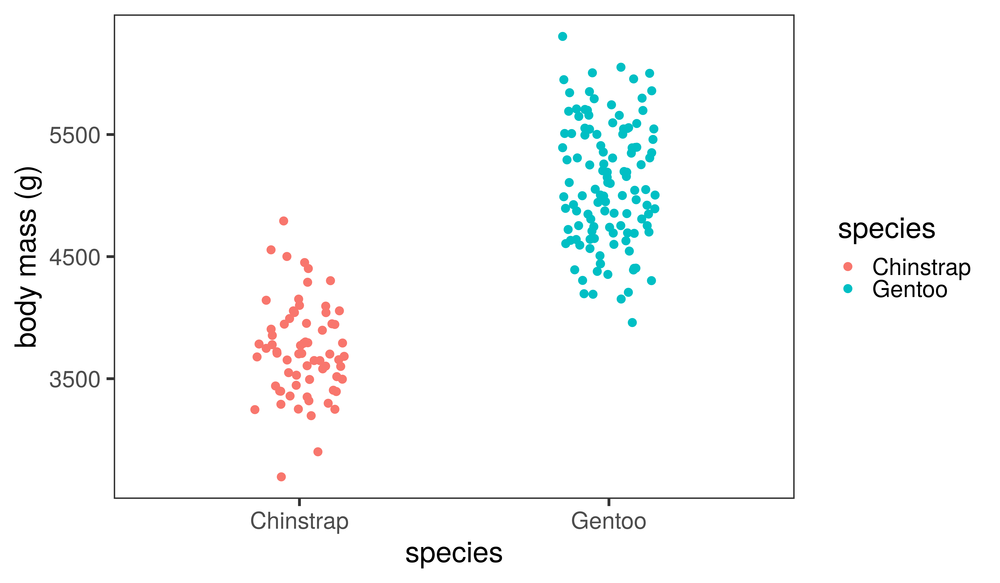
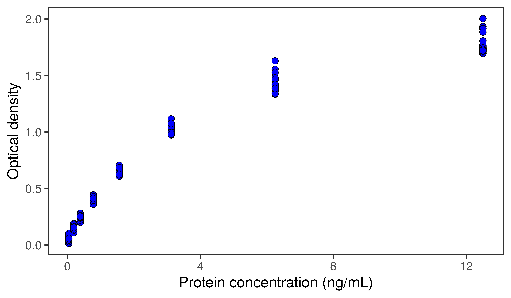
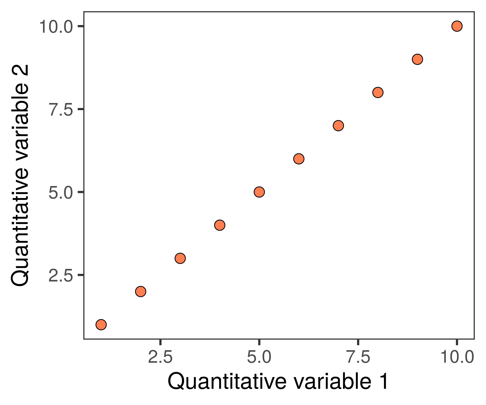
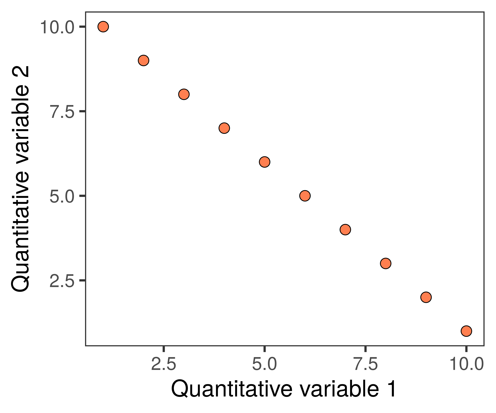
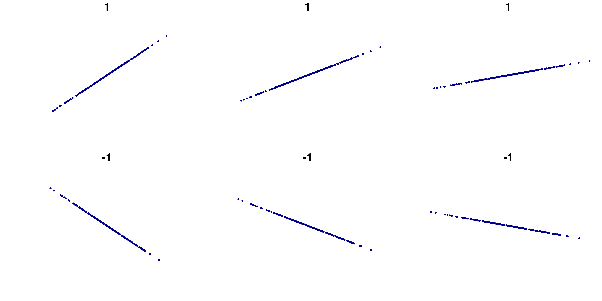
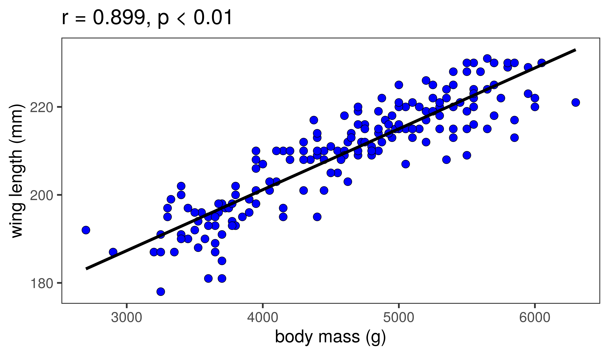

<!-- adding bold and italic options -->

## Data analysis 4

- Visualising two quantitative variables: scatterplots
- Dependent and independent variables
- Fitting a linear relationship: `least squares`
- Correlation coefficients: `r`
- Interpreting a correlation
- Quantifying the linear relationship
- Modelling the relationship: linear regression

--- .segue .dark 

## Visualising two quantitative variables

--- .class bg:white

## One categorical variable, one quantitative variable

--- .class bg:white

## Two quantitative variables

--- .class #id

## Which variable goes on which axis?

- We need to identify the `independent` and `dependent` variables
- The independent variable goes on the *x* axis
- The dependent variable goes on the *y* axis

### In an experiment
- The independent variable is **the thing we manipulate**
- The dependent variable is **the thing we expect to change**
- We hypothesise the independent variable has an effect on the dependendent variable
- The null hypothesis is no effect

--- .class #id

## Examples

Dependent variable|Independent variable
---------------------|--------------------
Number of species|Habitat
Blood pressure|Drug test and control groups
Number of genes|Free living or parasitic microorganism
Disease prevalence|Country
Gene expression|Developmental stage

--- .class bg:white

## ELISA assay development

- Measure optical density at known protein concentrations

--- .segue .dark 

## Sometimes, it's uncertain

--- .class bg:white

## Exploratory analysis of Gentoo penguin data

--- .class bg:white

## Exploratory analysis of Gentoo penguin data

--- .segue .dark 

## Fitting a linear relationship

--- .class #id

## Correlation

A connection, or relationship, between two or more things

### In Biosciences

A linear relationship between two quantitative variables

--- &twocol

## Linear relationship

- The points in the scatterplot form a straight line

*** =left

- Positive correlation

*** =right

- Negative correlation

--- .class bg:white

## Fitting a linear relationship to real data

- We can add a `line of best fit` using the method of `least squares`
- The straight line that minimises the square of the `residuals`

--- .class bg:white

## Fitting a linear relationship to real data

- We can add a `line of best fit` using the method of `least squares`
- The straight line that minimises the square of the `residuals`

--- .class #id

## Calculating the strength of the relationship

### If the residuals are small, the variables have a strong linear relationship

- We can measure this strength using a `correlation coefficient`
- We will use the `Pearson correlation coefficient`, which can be represented as `r`
- Scales from -1 to +1
- 0 = **no** linear relationship
- +1 = perfect **positive** linear relationship
- -1 = perfect **negative** linear relationship
- We can also obtain a `p-value`
- **Null hypothesis**: there is no linear relationship, the true `r` = 0

--- .class bg:white

## `r` shows the strength of correlation

*R code for plot by Denis Boigelot*

--- .class bg:white

## The slope does not affect `r`

*R code for plot by Denis Boigelot*

--- .class bg:white

## Pearson correlation for penguin data

--- .segue .dark 

## Interpreting a correlation

--- .class #id

## Scientists have found the gene for...

<iframe src = 'https://news.sky.com/story/covid-19-gene-that-doubles-risk-of-death-from-covid-identified-by-oxford-university-scientists-12459684' height='600px'></iframe>

--- .class bg:white

## Eating ice cream does not cause dehydration

--- .segue .dark 

## Quantifying the linear relationship

--- .class bg:white

## `r` does not provide information on slope

### but isn't the slope interesting?

*R code for plot by Denis Boigelot*

--- .class #id

## Limitations of correlation

- We would like to be able to **quantify** how much a variable changes
- This would allow us to **predict** the value of one variable if we know the value of another
- Even `extrapolate` beyond the range of measurement

### To do this

- We assume that the 2 variables have a linear relationship (significant correlation)
- We set up a statistical `model` of how the relationship works
- We fit the data to the model using `linear regression`

--- .segue .dark 

## Modelling the relationship

--- &twocol bg:white

## Setting up the linear model

*** =left

- Our model has several `coefficients`
- These are like parts of the model:
  + The **slope** of the line
  + The **y-axis intercept**
- There is also variance, or error of the datapoints
- These are basically unknown and/or unsampled variables
- We can quantify how well the data is explained by the linear model using `R-squared`

*** =right

--- &twocol bg:white

## Carrying out the regression

*** =left

- The regression fits the data to the linear model using least squares
- The slope is **0.945**
- The y-axis intercept is **10.291**
- R-squared is **0.972**
- The remaining variation is due to unknown or unsampled variables

*** =right

--- &twocol bg:white

## Now the really cool bit

*** =left

- We can predict the dependent variable for any value of the independent variable
- y = slope*x + intercept
- For example, x = 2.5
- y = 2.5*0.945 + 10.291
- y = 12.6527176

**Now**

- Let's call slope *m*
- And the intercept *c*
- y = *mx* + *c*
- The general formula for a linear relationship

*** =right

--- .segue .dark 

## The graph is the visualisation of the model

--- .class bg:white

## Linear regression for penguin data

Slope = 0.01384, y axis intercept = 0.01384, R-squared = 0.8063

--- .class #id

## Data analysis 4

- Visualising two quantitative variables: scatterplots
- Dependent and independent variables
- Fitting a linear relationship: `least squares`
- Correlation coefficients: `r`
- Interpreting a correlation
- Quantifying the linear relationship
- Modelling the relationship: linear regression

--- &thankyou

## That's all folks!

**Next: revision session and exam**
